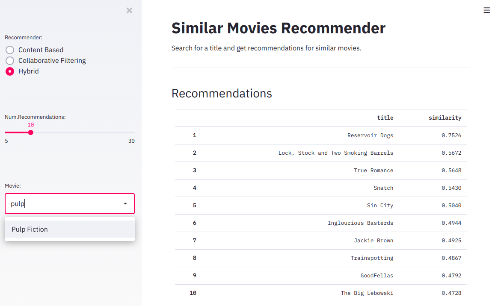

Movie Similarity
================
**Author:** David Pinto</br>
2020-10-21

> This project implements a recommender system for similar movies based on content and collaborative filtering embedding features.

First of all, read the documentation at the `proposal` folder.

## Setup

Create a `conda` environment:

```
# Create environment
conda create -n movie-similarity -y python=3.7

# Activate environment
conda activate movie-similarity

# Append conda-forge to the list of channels
conda config --append channels conda-forge

# Install dependencies
conda install -y --file env_requirements.txt

# Add environment to Jupyter
python -m ipykernel install --user --name=movie-similarity
```

## Dataset

Take a look at the `data/raw` folder to get instructions on how to download the dataset.

## Notebooks

The project is organized on Jupyter notebooks. They are numbered in the execution order. Each notebook is well documented. I hope you enjoy all code!

## Embedding Visualization

You can play with the movie embedding features using the Embedding Projector [here](https://projector.tensorflow.org/?config=https://raw.githubusercontent.com/davpinto/ml-eng-project/master/projector/embedding_projector_config.json). It can take a few seconds to start. But it will be worth it!

Take a look at the `projector` folder to see some results.

## Deploy Web Application

The project provides a [Streamlit](https://www.streamlit.io/) application to play with the movie recommender.

To run it locally:

```bash
make docker-build
make docker-run
```

Congratulations! You have it running on `127.0.0.1:8501`:

------

------

Choose an recommendation algorithm and a movie title to get recommendations of similar movies. I hope you enjoy it!
