```{r setup, include=FALSE}
knitr::opts_chunk$set(echo=FALSE,  message=FALSE, warning=FALSE,
                      cache=FALSE, fig.align="center", fig.path="img/", dpi = 90, 
                      fig.height = 4, out.width = "80%", cache = FALSE, 
                      cache.path = "cache/")
```

# Definition

## Project Overview

The main goal of this project is to develop a **Movie Similarity Recommender** over the full version of the famous [MovieLens](https://grouplens.org/datasets/movielens/) dataset. The developed solution aims to recommend similar items given a particular movie, so that users that already watched the later are likely to enjoy the recommended movies. It involves **Recommender Systems**$^1$ theory and **Similarity Matching**$^2$ techniques.

To properly achieve this we combine two datasets, one that provides movie ratings to be used as interaction data, and another that provides movie metadata to be used as content features.

### Movie Ratings

The full [MovieLens](https://grouplens.org/datasets/movielens/latest/) dataset, which contains `27M ratings` given to `58K movies` by `280K users`.

### Movie Metadata

Data retrieved from the [TMDB Open API](https://www.themoviedb.org/documentation/api) and available as a [Kaggle Dataset](https://www.kaggle.com/rounakbanik/the-movies-dataset). It contains information on 45k movies featured in the full MovieLens dataset. Features include title, description, genre and cast&crew information.

## Problem Statement

Recommending similar items is a very common task in many online selling platforms$^3$. It provides recommendations like: **related to items you've viewed**, **recommended for you based on your previous purchase**, **customers who bought this item already bought**, so on. The main challenges involved are:

**(a) The cold start problem**

How to recommend recent added products with few or no associated interaction data?

One way to cope with this consists in take advantage of product metadata (content features): `name`, `description`, `category`, `price level`, so on. Then we can link a product with others by content similarity. We call this as **Content Based** approach.

**(b) The popularity bias problem**

According to the **Long Tail phenomenon**$^4$, selling niche products has many advantages. Users are likely to pay more for niche products because they cannot find it everywhere. However, best seller products have more interaction data available to train a recommender system so that the fitted model may be subjected to popularity bias. In other words, the model will be more likely to recommend popular items.

Again, using content features to find similar items reduces popularity bias. But interaction data is very important to understand user behavior and cannot be discarded. So, in this project we apply a **Collaborative Filtering** factorization that takes into account item and user popularity.

### Movie Embeddings and Similarity Matching

First of all, we use both interaction and content data to extract item embedding$^5$ features, which are low-dimensional dense vectors that captures some of the semantics of the item by placing semantically similar items close together in the embedding space. It allows efficient nearest neighbors search, so that we can find similar movies fast in application time.

- **Content Embedding:** embedding features extracted from text fields like title and description, and from categorical fields like genre and cast&crew.
- **Collaborative Filtering Embedding:** embedding features extracted from user-movie interactions given by the ratings.

All the details about the feature extraction process will be discussed later.

After computing the embedding features, similar movies will be recommended using **Approximate Nearest Neighbors** (ANN) search with cosine similarity. The cosine similarity is the most common affinity metric applied for similarity search in the embedding space.

## Metrics

### Users Intersection as a Similarity Measure

Let's consider every rating (from 1 to 5) above 3.5 as an explicit feedback that the user liked the movie. Then we can measure the similarity between a pair of movies $(x,y)$ as:

$$
S(x,y) = \displaystyle\frac{N_{xy}}{\sqrt{N_xN_y}}
$$

where $N_x$ is the number of users that liked movie x, $N_y$ is the number of users that liked movie y, and $N_{xy}$ is the number of users that liked both x and y.

So, $S(x,y)$ close to 1 is a strong evidence that users who liked x will like y too. We call this as **User Correlation**.

Despite providing good recommendations, this similarity is very sparse, resulting in a discrete recommendation. So, if we try to recommend the top 30 similar to each movie we will get less than 30 for many movies. In other words, we will have many movies with few or none similar items to be recommended. 

The embedding features solve this problem. Since we are computing distances between pairs of movies in a dense and low-dimensional space, the embedding features provide a continuous recommendation. We are able to find similar items to any movie, with high evidence (low distance) or low evidence (high distance).

### Evaluating the Embedding Features

How close the similarity match with embedding features can get to the similarity match given by the user's likes (user correlation)?

**(a) Ranking correlation**

In a attempt to answer this question, we can randomly select $n$ test movies and get their top N similar using the $S(x,y)$ measure. Then, for each test movie, we get the distances $D(x,y)$ from the top N similar using the embedding features. Finally, for each test movie, we apply the Spearman's Rank-Order Correlation Coefficient ($\rho$) between $S$ and $1/D$, which is equal to the Pearson's correlation between the rank values of them.

For all test movies, we get an average rank correlation:

$$
\frac{1}{n}\sum_{i=1}^n\rho(S_i, 1/D_i)
$$

**(b) Precision and Recall at K**

Given a threshold $t_S$ for $S(x,y)$, we will assume that $S(x,y) \geq t_S$ indicates a strong/relevant similarity. So, given the K nearest neighbors from embedding features of a test movie:

$$
\text{precision@k} = \frac{\#\text{relevants@k}}{K}
$$

$$
\text{recall@k} = \frac{\#\text{relevants@k}}{\#\text{relevants}}
$$

For all test movies, we get an average $\text{Precision@K}$ and an average $\text{Recall@K}$.

# Analysis

## Data Preparation

First of all, take a look at `data/raw` to get instructions on how to download the datasets.

Data Preparation was a quite hard extra work in this project. As a previous step, we had to apply some manipulations in order to prepare data for analysis: 

1. We set MovieLens ID as the primary key in both datasets, MovieLens and TMDB.
1. We transformed Cast&Crew, movie Genre and movie Keywords data from a JSON format to a [Tidy Data](https://cran.r-project.org/web/packages/tidyr/vignettes/tidy-data.html) format.
1. We concatenated all movie Keywords in a single text field.
1. We concatenated all movie Tags assigned by the users in a single text field.

Then, we applied some filters in an attempt to discard weak relations in the data:

1. In the Cast data we selected actors that appeared in at least 10 movies.
1. In the Crew data we considered just `director`, `producer` and `writer`, and selected those that appeared in at least 10 movies.
1. From the movie metadata we selected just the text fields: `title`, `overview` and `tagline`.
1. From the ratings data (interaction data) we removed users which voted less than 3 tines and movies with less than 30 votes. Items and users with poor interaction information can induce Collaborative Filtering to learn wrong correlations in the data.

All code is well organized and documented in the `01-data-preparation.ipynb` notebook.

## Data Exploration

From the Data Preparation step we finished up with 7 datasets in tidy format:

- `data/movie_info.csv`:
```{r}
library(data.table)
library(kableExtra)

dt <- fread("../data/movie_info.csv", nrows=5, select=c("id", "title", "overview", "tagline"))
dt[, overview := sprintf("%s (...)", substr(overview, 1, 30))]
dt[, tagline := sprintf("%s (...)", substr(tagline, 1, 30))]

kbl(dt, booktabs = T) %>%
  kable_styling(latex_options = "striped")
```

- `data/movie_keywords.csv`:
```{r}
dt <- fread("../data/movie_keywords.csv", nrows=5)
dt[, keywords := sprintf("%s (...)", substr(keywords, 1, 30))]

kbl(dt, booktabs = T) %>%
  kable_styling(latex_options = "striped")
```

- `data/movie_tags.csv`:
```{r}
dt <- fread("../data/movie_tags.csv", nrows=5)
dt[, tags := sprintf("%s (...)", substr(tags, 1, 30))]

kbl(dt, booktabs = T) %>%
  kable_styling(latex_options = "striped")
```

- `data/movie_genre.csv`:
```{r}
dt <- fread("../data/movie_genre.csv", nrows=5)

kbl(dt, booktabs = T) %>%
  kable_styling(latex_options = "striped")
```

- `data/movie_actor.csv`:
```{r}
dt <- fread("../data/movie_actor.csv", nrows=5)

kbl(dt, booktabs = T) %>%
  kable_styling(latex_options = "striped")
```

- `data/movie_producer`:
```{r}
dt <- fread("../data/movie_producer.csv", nrows=5)

kbl(dt, booktabs = T) %>%
  kable_styling(latex_options = "striped")
```

- `data/movie_ratings`:
```{r}
dt <- fread("../data/movie_ratings.csv", nrows=5)

kbl(dt, booktabs = T) %>%
  kable_styling(latex_options = "striped")
```

After all cleaning process we got text description for `20400` movies, keywords for `31116` movies, tags for `45981` movies, genres for `20136` movies, `10465` actors for a total of `35649` movies, `4106` director/producer/writer for a total of `24325` movies, and `27516829` ratings for a total of `15967` movies given by `273643` distinct users.

## Exploratory Visualization

Now we invite you to take a brief tour over the data. For more details, the `02-exploratory-analysis.ipynb` notebook contains all code for the Exploratory Data Analysis we present here.

### Ratings Distribution

First of all, let's observe the distribution of ratings. We have 10 possible values for the user rating: $[0.5, 1.0, 1.5, 2.0, 2.5, 3.0, 3.5, 4.0, 4.5, 5.0]$. In which proportion each one of these values appear in the data?

```{r}
library(symplyr)
library(data.table)
library(ggplot2)

ratings <- file_import_csv("../data/movie_ratings.csv", threads = 6)

ratings[, rating_cat := as.factor(sprintf('%.01f', rating))]
ratings.dist <- ratings[, .(n = .N), by = 'rating_cat']

plot_bars(x = ratings.dist$n, labels = ratings.dist$rating_cat) +
  labs(x = "Rating Level", y = "Frequency") +
  theme_symplyr()
```

Just a small part of the ratings fall bellow `3.0`. If we look at the movie average rating we will observe a similar behavior:

```{r}
ratings.avg = ratings[, .(avg_rating = mean(rating)), by = 'id']

plot_histogram(x = ratings.avg$avg_rating, breaks = 30) +
  labs(x = "Average Rating", y = "Frequency") +
  scale_x_continuous(breaks = seq(0, 5, by = 0.5)) +
  scale_y_continuous(breaks = seq(0, 1.5e3, by = 100)) +
  theme_symplyr()
```

In general, users tend to give good ratings to the movies they vote. It may be an evidence that users are most likely to vote in those movies they like. It makes sense, since users usually watch movies with actors and/or directors they already know and like, and in the genre they like most.

### Ratings as Likes and Dislikes

In this project we will convert ratings to likes (`>=3.5`) and dislikes (`<3.5`). Let's take a look the the distribution of number of likes:

```{r}
ratings[, like := ifelse(rating >= 3.5, 1, 0)]
ratings.like = ratings[, .(avg_rating = mean(rating), num_likes = sum(like), num_votes = .N), by = 'id']

plot_histogram(x = log(ratings.like$num_likes + 1), breaks = 30) +
  scale_x_continuous(breaks = seq(0, 12, by = 1), limits = c(0, 12)) +
  scale_y_continuous(breaks = seq(0, 2e3, by = 2.5e2), limits = c(0, 2e3)) +
  labs(x = "Log Num. Likes", y = "Frequency") +
  theme_symplyr()
```

We got a very asymmetric empirical distribution, so we applied the `log` transformation to make it easy to visualize the full distribution. Just to have an idea, `10` in the log scale corresponds to about `22025` likes.

Now, let's see how the number of dislikes behave:

```{r}
ratings.like[, num_dislikes := num_votes - num_likes]

plot_histogram(x = log(ratings.like$num_dislikes + 1), breaks = 30) +
  labs(x = "Log Num. Dislikes", y = "Frequency") +
  scale_x_continuous(breaks = seq(0, 12, by = 1)) +
  scale_y_continuous(breaks = seq(0, 2e3, by = 2.5e2)) +
  theme_symplyr()
```

Is there any movie with more dislikes them likes?

```{r}
x <- log(ratings.like$num_likes + 1) - log(ratings.like$num_dislikes + 1)
plot_histogram(x = x, breaks = 30) +
  scale_x_continuous(breaks = seq(-4, 4)) +
  scale_y_continuous(breaks = seq(0, 1.5e3, by = 2.5e2)) +
  labs(x = "Log Num. Likes - Log Num. Dislikes", y = "Frequency") +
  theme_symplyr()
```

Since we have negative values, the answer to the last question is yes.

Is there a consistent bias in the average rating to popular movies?

```{r}
ggplot(ratings.like, aes(x = num_votes, y = avg_rating)) +
  geom_point(size = 0.5, alpha = 0.8, color = "gray20") +
  geom_smooth(color = "#66c2a5", alpha = 0.8, method = 'loess') +
  scale_x_continuous(breaks = seq(0, 1e5, by = 1e4)) +
  scale_y_continuous(breaks = seq(0, 5, by = 0.5)) +
  labs(x = "Num. Votes", y = "Avg. Rating") +
  theme_symplyr()
```

Yes, we can see a popularity bias. Movies with more than 20k votes have average rating above `3.0`. Movies with more than 50k votes tend to have average rating above `4.0`.
 
### Most Liked and Most Hated Movies

Which movies are the most liked by the users?

```{r}
movies <- file_import_csv("../data/movie_info.csv")

setorder(ratings.like, -num_likes)
best.movies <- merge(head(ratings.like, 10), movies[, c("id", "title")])
setorder(best.movies, -num_likes)

kbl(best.movies[, c('title', 'num_likes')], booktabs = T) %>%
  kable_styling(latex_options = "striped")
```

How about the most disliked movies by the users?

```{r}
setorder(ratings.like, -num_dislikes)
worst.movies <- merge(head(ratings.like, 10), movies[, c("id", "title")])
setorder(worst.movies, -num_dislikes)

kbl(worst.movies[, c('title', 'num_dislikes')], booktabs = T) %>%
  kable_styling(latex_options = "striped")
```

### Genre Distribution

Now, let's check the distribution of movie genres:

```{r fig.width=6, fig.height=4}
genres <- file_import_csv("../data/movie_genre.csv")
genres <- unique(genres, by = c('id', 'genre_id'))

genre.prop <- genres[, .(n = .N), by = 'genre_name']

plot_bars(x = genre.prop$n, labels = genre.prop$genre_name) +
  labs(x = "Genre", y = "Num. Movies") +
  scale_y_continuous(breaks = seq(0, 1e4, by = 1e3)) +
  theme_symplyr()
```

The Drama genre is present in about 20% of the movies, it's very frequent. On the other hand, now I understand why it's so hard to find new Western movies to watch. Just 1.5% of the movies are Western.

### Most Liked Western and Horror Movies

Let's take a look at my personal favorite genres, Western and Horror. Which movies are the most liked by the audience?

**Western Movies:**

```{r}
genres.like <- merge(merge(ratings.like, genres, by = 'id'), movies, by = "id")
setorder(genres.like, -num_likes)

genres.like[genre_name == 'Western', c('title', 'num_likes')] %>% 
  head(10) %>% 
  kbl(booktabs = T) %>%
  kable_styling(latex_options = "striped")
```

**Horror Movies:**

```{r}
genres.like[genre_name == 'Horror', c('title', 'num_likes')] %>% 
  head(10) %>% 
  kbl(booktabs = T) %>%
  kable_styling(latex_options = "striped")
```

I totally agree with the ranking!

### Most Liked and Most Hated Directors

Can we find the public opinion about the movie directors based on the number of likes and dislikes given to the movies they worked on? To answer this question, we subtracted the number of likes by the number of dislikes considering all movies each director worked. Here it follows the ranking of the most liked and most disliked directors:

```{r}
directors <- file_import_csv("../data/movie_producer.csv")[job == "Director",]
directors <- unique(directors, by = c("id", "person_id"))
directors <- merge(merge(directors, ratings.like, by = "id"), movies, by = "id")

directors.stats <- directors[, .(num_likes = sum(num_likes), num_dislikes = sum(num_dislikes), 
                                 best_movie = title[which.max(num_likes)], 
                                 worst_movie = title[which.max(num_dislikes)],
                                 name = person_name[1]), by = 'person_id']
directors.stats[, delta_like := num_likes - num_dislikes]
setorder(directors.stats, -delta_like)

directors.stats[, c('name', 'delta_like',  'best_movie')] %>% 
  head(15) %>% 
  kbl(booktabs = T, col.names = c('Director', 'Delta Likes', 'Most Liked Movie')) %>%
  kable_styling(latex_options = "striped")
```

The `Schindler’s List` list is in the top 10 most liked movies and helped `Steven Spielberg` to be the first in the ranking.

```{r}
directors.stats[, c('name', 'delta_like',  'worst_movie')] %>% 
  tail(15) %>%
  dplyr::arrange(delta_like) %>% 
  kbl(booktabs = T, col.names = c('Director', 'Delta Likes', 'Most Hated Movie')) %>%
  kable_styling(latex_options = "striped")
```

On the other hand, `Ace Ventura`, the first in the list of the most disliked movies, put two directors in the list of the 10 most disliked ones.

### Most Liked and Most Hated Actors

How about the actors?

```{r}
actors <- file_import_csv("../data/movie_actor.csv")
actors <- unique(actors, by = c("id", "actor_id"))
actors <- merge(merge(actors, ratings.like, by = "id"), movies, by = "id")

actors.stats <- actors[, .(num_likes = sum(num_likes), num_dislikes = sum(num_dislikes), 
                           best_movie = title[which.max(num_likes)], 
                           worst_movie = title[which.max(num_dislikes)],
                           name = actor_name[1]), by = 'actor_id']
actors.stats[, delta_like := num_likes - num_dislikes]
setorder(actors.stats, -delta_like)

actors.stats[, c('name', 'delta_like',  'best_movie')] %>% 
  head(15) %>% 
  kbl(booktabs = T, col.names = c('Actor', 'Delta Likes', 'Most Liked Movie')) %>%
  kable_styling(latex_options = "striped")
```

The `The Shawshank Redemption` put two actors in the list of the 10 most liked actors!

```{r}
actors.stats[, c('name', 'delta_like',  'worst_movie')] %>% 
  tail(15) %>% 
  dplyr::arrange(delta_like) %>% 
  kbl(booktabs = T, col.names = c('Actor', 'Delta Likes', 'Most Hated Movie')) %>%
  kable_styling(latex_options = "striped")
```

The `Ace Ventura` definitely didn't fall in popular taste.

## Algorithms and Techniques

### Building Content Embeddings

For text features (title, description, keywords and user comments/tags) we concatenate them all and extract a sparse TF-IDF matrix using the [`TfidfVectorizer`](https://scikit-learn.org/stable/modules/generated/sklearn.feature_extraction.text.TfidfVectorizer.html).

For the categorical features (genre, cast and crew) we expand them into sparse binary features.

Both representations result in high-dimensional and sparse matrices. So, we combine them and apply the sparse [`TruncatedSVD`](https://docs.scipy.org/doc/scipy/reference/generated/scipy.sparse.linalg.svds.html) algorithm to get low-dimensional and dense representations, the embedding features.

The [`implicit` (link)](https://implicit.readthedocs.io/en/latest/index.html) package provides some fast factorization algorithms more powerful than SVD. They are great alternatives and may improve the representations.

### Building CF Embeddings

The [`surprise` (link)](http://surpriselib.com/) package provides many classical factorization algorithms for explicit feedback problems. We can apply than in the user-movie ratings matrix to extract latent factors for the users and movies. Then, the movie factors can be used as embedding features.

However, we decided to try an approach based on likes and dislikes. Ratings above 3.5 will be considered likes (+1), while ratings below 3.5 will be considered dislikes (-1). From this assumption, we can build a user-movie matrix with (-1,+1) values and use a logistic loss to factorize this matrix. The [`LighFM` (link)](https://making.lyst.com/lightfm/docs/lightfm.html) package provides a logistic loss factorization algorithm with additive bias. So, it takes into account the user and the movie bias, abstracting popularity away from the embedding features. This is an attempt to solve the item popularity problem.

### Similarity Match

After computing the embedding features we recommend similar movies using an approximate nearest neighbors search with cosine similarity. The [`faiss`](https://github.com/facebookresearch/faiss) package is our choice, since it provides an extremely fast and scalable ANN algorithm.

### Hybrid Approach

First, we evaluate the recommendations given by the content embedding features and compare the result with the performance for the CF embedding features. Then, as a final attempt, we test a hybrid approach which works as follows:

1. Select a target movie for which we will recommend similar ones.
1. Compute the cosine similarity between the target and the candidates using the content embedding features.
1. Compute the cosine similarity between the target and the candidates using the CF embedding features.
1. Order the candidates by the sum between the computed similarities in the last 2 steps.

It's the same as combining the embedding features (content based + collaborative filtering) and taking the cosine similarities over them all. Since this approach combines content information with interaction information, it may provide better recommendations.

## Benchmark

To evaluate the embedding features in the similarity search task we established the user correlation as our benchmark. Basically, the similarity between a pair of movies $(1,2)$ is proportional to the number of users that liked both, as follows:

$$
S_{1,2} = \displaystyle\frac{n_{12}}{\sqrt{n_1 n_2}}
$$

where:

- $n_1$ is the number of users that liked movie 1.
- $n_2$ is the number of users that liked movie 2.
- $n_{12}$ is the number of users that liked both movie 1 and movie 2.

To find the number of users that liked each pair of movies we need to compute a cartesian join with the ratings dataset. It's a very expensive operation over a dataset with 27M rows. The `pandas` library is not able to perform this task. It requires lots of RAM and may take several minutes to complete. So, we decided to try the [vaex](https://github.com/vaexio/vaex) library. It allows to split data into chunks and perform operations chunk by chunk. It is very efficient and its API is very similar to `pandas`.

To reduce time and memory consumption even more we randomly selected a subset of `500` movies. It's enough to evaluate the embedding features. In order to keep the most famous movies, we assigned the number of likes as the probability to select the movie.

The operation over the `ratings` dataset works as follows:

1. Filter the ratings for the 500 randomly selected movies.
2. Filter rating values greater than or equal to `3.5` (likes).
3. Create 2 copies of the resulting dataset with the following column names: `movie_x, user` and `movie_y, user`.
4. Join the 2 dataframes by `user`. It results in a dataframe with `238,593,639` rows. Pandas took several minutes and resulted in memory overflow. Vaex easily solved the problem in just 10 seconds!
5. Group by `(movie_x, movie_y)` and count number of rows in each group. It gives us the $n_{1,2}$ term.
6. Summarize the dataframe on step 2 to get the number of likes for each movie.
7. Join the number of likes to the dataframe on step 5.
8. Compute the user correlation for each pair (x,y) of movies.

All code is well organized and docvumented in the `03-user-based-similarity.ipynb` notebook.

Let's check the distribution of the similarity values:

```{r}
user.sim <- file_import_csv('../output/movie_similarity.csv', select = c('id_left', 'id_right', 'similarity'))

plot_histogram(user.sim$similarity, breaks = 30) +
  labs(x = "Similarity", y = "Frequency") +
  scale_y_continuous(breaks = seq(0, 1.2e3, by = 1e2)) +
  scale_x_continuous(breaks = seq(0, 1, by = 0.1)) +
  theme_symplyr()
```
Considering `0.3` as an evidence of correlation/similarity between a pair, let's check the empirical cumulative probability:

```{r}
plot_density_with_target(user.sim$similarity, 0.3) +
  labs(x = "Similarity") +
  scale_x_continuous(breaks = seq(0, 1, by = 0.1)) +
  theme_symplyr()
```

Which are the top correlated movies based on user likes?

```{r}
user.sim <- merge(user.sim, movies[, c('id', 'title')], by.x = 'id_left', by.y = 'id')
setnames(user.sim, "title", 'title_left')
user.sim <- merge(user.sim, movies[, c('id', 'title')], by.x = 'id_right', by.y = 'id')
setnames(user.sim, "title", 'title_right')
user.sim[, title_left := sprintf("%s (...)", substr(title_left, 1, 30))]
user.sim[, title_right := sprintf("%s (...)", substr(title_right, 1, 30))]

setorder(user.sim, -similarity)

user.sim[, c('title_left', 'title_right', 'similarity')] %>% 
  head(30) %>% 
  kbl(booktabs = T, digits = 3) %>%
  kable_styling(latex_options = "striped")
```

Which are the most similar movies to *The Lord of the Rings*?

```{r}
user.sim[id_left == 4993, c('title_left', 'title_right', 'similarity')] %>% 
  head(10) %>% 
  kbl(booktabs = T, digits = 3) %>%
  kable_styling(latex_options = "striped")
```

Which are the most similar movies to *Star Wars*?

```{r}
user.sim[id_left == 260, c('title_left', 'title_right', 'similarity')] %>% 
  head(10) %>% 
  kbl(booktabs = T, digits = 3) %>%
  kable_styling(latex_options = "striped")
```

Which are the most similar movies to *Pulp Fiction*?

```{r}
user.sim[id_left == 296, c('title_left', 'title_right', 'similarity')] %>% 
  head(10) %>% 
  kbl(booktabs = T, digits = 3) %>%
  kable_styling(latex_options = "striped")
```

# Methodology

## Code Organization

We organized the solution in Jupyter Notebooks:

- [1. Data Preparation](https://nbviewer.jupyter.org/github/davpinto/ml-eng-project/blob/master/01-data-preparation.ipynb).
- [2. Exploratory Analysis](https://nbviewer.jupyter.org/github/davpinto/ml-eng-project/blob/master/02-exploratory-analysis.ipynb).
- [3. User Based Similarity](https://nbviewer.jupyter.org/github/davpinto/ml-eng-project/blob/master/03-user-based-similarity.ipynb).
- [4. Content Based Embedding](https://nbviewer.jupyter.org/github/davpinto/ml-eng-project/blob/master/04-content-based-embedding.ipynb).
- [5. Collaborative Fltering Embedding](https://nbviewer.jupyter.org/github/davpinto/ml-eng-project/blob/master/05-collaborative-filtering-embedding.ipynb).
- [6. Similarity Match with ANN](https://nbviewer.jupyter.org/github/davpinto/ml-eng-project/blob/master/06-similarity-match-with-ann.ipynb).
- [7. Performance Evaluation](https://nbviewer.jupyter.org/github/davpinto/ml-eng-project/blob/master/07-performance-evaluation.ipynb).
- [8. Hybrid Approach](https://nbviewer.jupyter.org/github/davpinto/ml-eng-project/blob/master/08-hybrid-approach.ipynb).

They were carefully refactored and documented.

Moreover, we used a Python package structure to organize the functions applied in the notebooks. All code can be find in the `src` folder.

## Data Preprocessing

In the *Data Preparation* step we transformed data to a tidy format. Now we preprocess features to put it in a numerical format for embedding extraction.

### Text Features

First of all, we combined all text fields (`title`,`overview`,`tagline`, `tags` and `keywords`) into a single one. Then we applied some text cleaning:

- Lower case.
- Remove numbers, punctuation and special chars.
- Remove single char words.
- Remove stopwords.

To encode text into numerical features we used the [TfidfVectorizer](https://scikit-learn.org/stable/modules/generated/sklearn.feature_extraction.text.TfidfVectorizer.html) method with the following parameters:

- Uni-grams and bi-grams.
- Vocabulary of 30k terms.
- Minimum document frequency of 5.
- Maximum document frequency of 50%.
- Scale rows by their l2-norm.

We got a Tf-Idf matrix with dimension `20624 x 30000` and `99.79%` of sparsity. 

Since the cosine similarity between two vectors is their dot product when their l2-norm is equal to 1, we always apply this normalization. The `faiss` package requires normalized vectors to find nearest neighbors.

All code is available in the `04-content-based-embedding.ipynb` notebook.

### Categorical Features

`Genre` and `Cast&Crew` are categorical features. To improve content representation, we need to combine them with the Tf-Idf features. We may try a classical one-hot-encoding process, but these features have high cardinality. Representing them by a dense binary matrix may consume lots of RAM and make the embedding extraction very slow. So we represent them using sparse matrices and apply l2-normlization on rows.

For *Crew* we got a `20624 x 3635` sparse matrix with `99.81%` of sparsity. It means that we are consuming just `0.19%` of the memory required by a dense matrix. For *Cast* we got a `20624 x 10269` sparse matrix with `99.94%` of sparsity. Finally, after combining the binary features with the Tf-Idf ones we got a `20624 x 43904` sparse matrix with `99.84%` of sparsity.

So, we have a high dimensional and high sparse content matrix to work with.

We decided to not include genre in the content matrix. We already have many information on text features about the movie, more specific than genre. Genre gives just a few binary features and may bring redundant information.

All code is available in the `04-content-based-embedding.ipynb` notebook.

### Ratings

For the ratings dataset we need to build an *Utility Matrix*. In other words, we need to put data into an user/movie matrix format. Users will be represented as rows, movies as columns and like(+1)/dislike(-1) as values. Since we have a large number of movies and the greatest part of the user/movie interactions are missing (a user votes in a small part of the movies, and a movie is evaluated by a small part of the users), a sparse representation is the better choice.

We transformed ratings into likes (rating `>=3.5` to `1.0`) and dislikes ( rating `<3.5` to `-1.0`) and got a `273627 x 10698` sparse matrix with `99.13%` of sparsity.

All code is available in the `05-collaborative-filtering-embedding.ipynb` notebook.

## Implementation

Now we describe how we extracted embedding features from the sparse matrices generated in the previous section.

### Content Based

We extract dense features from the sparse content matrix using the [TruncatedSVD](https://scikit-learn.org/stable/modules/generated/sklearn.decomposition.TruncatedSVD.html) algorithm. The parameter `algorithm="arpack"` is necessary to deal with a sparse matrix. It took less than 20 seconds to factorize the content matrix. 

We use `300` as the embedding dimension. It's a very common value in Word Embedding representations. 

Let's take advantage of the [Embedding Projector](https://projector.tensorflow.org/) tool to visualize the embedding features:

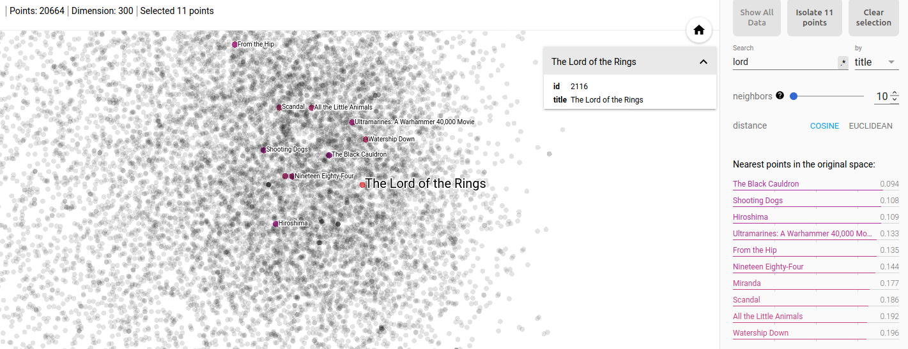

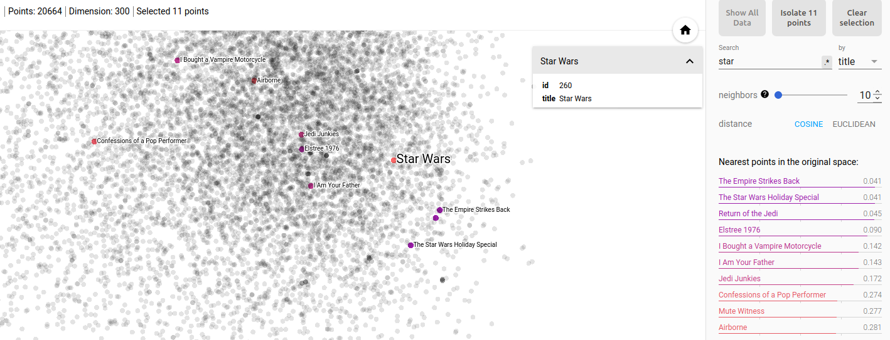

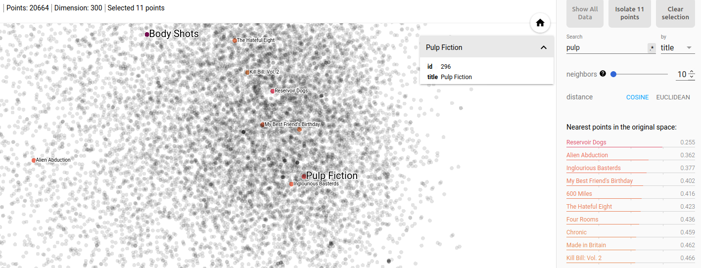

The nearest neighbors shown make sense.

For more details, check the `04-content-based-embedding.ipynb` notebook.

### Collaborative Filtering

We extract dense features from the utility matrix using the [LightFM](https://making.lyst.com/lightfm/docs/lightfm.html) algorithm with `logistic` loss (to deal with +1/-1 values). It took about 4 minutes to extract the user and item factors. The last are our embedding features. As in the content based approach, we set 300 as the embedding space dimension.

The LightFM algorithm learns the user and item factors with a bias term. It's important to overcome the popularity bias problem. Let's check how it relates to the movie average rating:

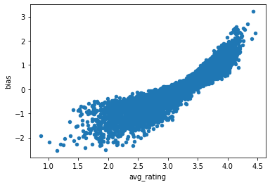

We see that the bias term captures the movie rating information. This way we remove the popularity bias from the embedding features.

Now, let's visualize the embedding features using the *Embedding Projector*:

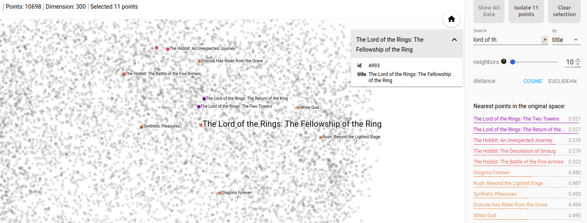

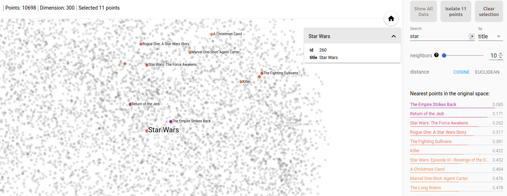

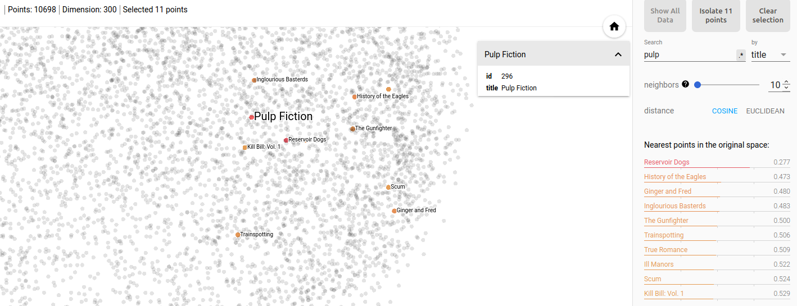

We have different neighbors when compared to the content based, but they make sense too.

### Hybrid Approach

It consists on combining content based with collaborative filtering embedding features. Computing the cosine similarity over this combination is the same as computing the cosine similarity individually over contend based and collaborative filtering and taking the average between the two values.

All code is organized and documented in the `08-hybrid-approach.ipynb` notebook. In the evaluation section we will show that content based and collaborative filtering are complementary solutions, which may be a evidence that the hybrid approach is more powerful.

### Similarity Match with ANN

Using the [faiss](https://github.com/facebookresearch/faiss) package we can efficiently find similar movies based on the cosine similarity.

In the `06-similarity-match-with-ann.ipynb` notebook we experimented with the embedding features using the `faiss` package. First we got the 30 nearest neighbors to each movie, which we will use to compute precision and recall at k. Then, we computed the cosine similarity between each movie and its 30 nearest neighbors given by user correlation. They will be used to compute ranking correlation in the next section.

### Public Movie Embedding

We published the embedding features (content based + collaborative filtering) on the Embedding Projector. You can play with it here: [Movie Embedding](https://projector.tensorflow.org/?config=https://raw.githubusercontent.com/davpinto/ml-eng-project/master/projector/embedding_projector_config.json).

More details can be seen in the `projector` folder.

### Movie Similarity Dashboard

Finally, we built a web application on which the user can choose a movie and get recommendations of similar movies, using the [`Streamlit` (link)](https://docs.streamlit.io/en/stable/) framework:

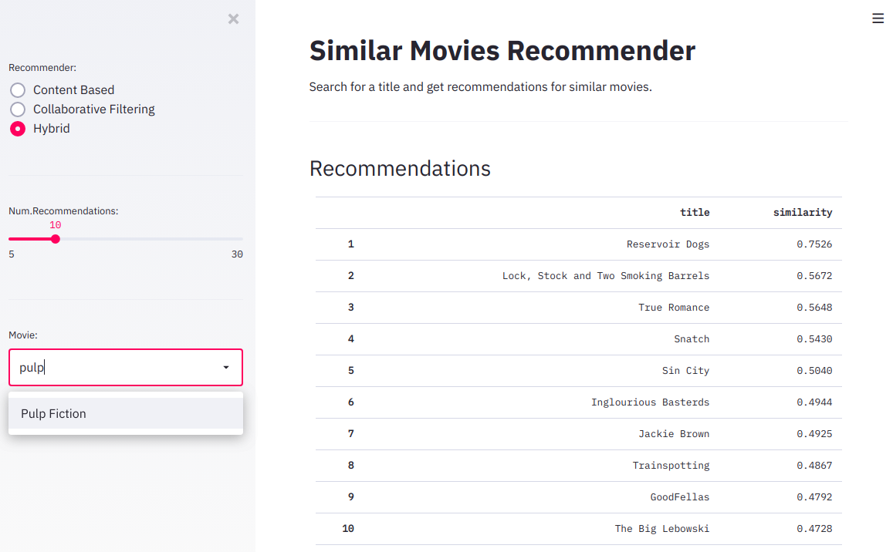.

We provide a `Dockerfile` to easily deploy the application in your computer. Follow the instructions in the project `README.md`.

## Refinement

Since we are not working with labeled data, hyper-parameter tuning is more complicated here. We set all parameters based on past knowledge or based on common choices in literature.

# Results

## Model Evaluation and Validation

In this section we compare recommendations based on the embedding similarity match with recommendations based on user correlation. The later is just a reference. We don't have the "correct" similar movies to measure performance properly. In an e-commerce, for example, we compare algorithms using A/B testing with business metrics like CTR and conversion. The better the business metric, the better the recommendation approach.

The complete analysis is provided in the `07-performance-evaluation.ipynb` notebook.

### Ranking Correlation

In the Similarity Match section we have computed the cosine similarity between pairs of movies. Now, we compare the user correlation ranking with the cosine similarity ranking based on the embedding features, using the Spearman correlation.

The Spearman Ranking Correlation Coefficient give us a value between -1 (exactly opposite order) and +1 (same order). Like the classical Pearson's Correlation Coefficient, values above 0.3 can be seen as an evidence of correlation.

For each target movie (the 500 movies selected in the Benchmark section) we computed the Spearman correlation between the user similarity values and the cosine similarity values for the movie's 30 nearest neighbors. To evaluate the performance, we can observe the distribution of the correlation measures for all 500 target movies, as follows:

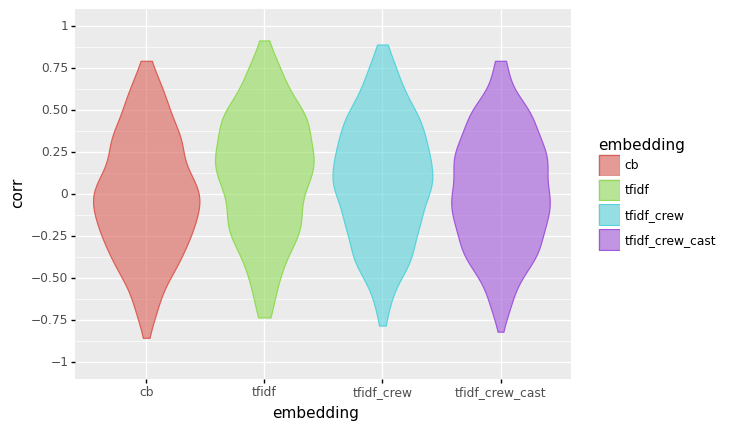.

The embedding features based on text data performed a little bit better than other approaches. It's a surprise, since text data does not carry any information about users. But there is a large overlapping between the distributions. So, there is no strong evidence of difference between methods.

In addition, including Cast&Crew information doesn't seem to improve the performance of the content embedding features. The Pearson's correlation between the `Tf-Idf` results and the `Tf-Idf + Cast&Crew` results is above `0.7`. So, Cast&Crew seems to provide redundant information to the embedding features.

### Precision and Recall

Another way to check ranking performance is to transform the problem into a classical binary classification problem, so that we can take advantage of better known metrics. Precision and recall are the most common ones.

First of all, we must label some items as 'relevant'. Than, we look for relevant items in the top K positions of the ranking. K in [5,10] is a common choice. Here we choose k=10.

Precision is given by the number of relevant items in the top K divided by K. In other words, it measures the proportion of the top K items that are relevant. Recall is given by the number of relevant items in the top K divided by the total number of relevant items. In other words, it measures the proportion of relevant items that are in the top K items.

We assigned as relevant all similar movies with user correlation above `0.3`. Then, to make a better evaluation, we considered only those target movies with 3 or more relevant similar movies.

We got very bad results for precision and recall. In general, the relevant movies are not appearing in the top 10 given by the embedding ranking. Here it follows what we got:

- Precision for the Tf-Idf Embedding:

| stats | value    |
| :---- | :------- |
| mean  | 0.016667 |
| std   | 0.057985 |
| min   | 0.000000 |
| 25%   | 0.000000 |
| 50%   | 0.000000 |
| 75%   | 0.000000 |
| max   | 0.400000 |

- Recall for the Tf-Idf Embedding

| stats | value    |
| :---- | :------- |
| mean  | 0.061658 |
| std   | 0.191476 |
| min   | 0.000000 |
| 25%   | 0.000000 |
| 50%   | 0.000000 |
| 75%   | 0.000000 |
| max   | 1.000000 |

- Precision for the CF Embedding

| stats | value    |
| :---- | :------- |
| mean  | 0.007471 |
| std   | 0.030439 |
| min   | 0.000000 |
| 25%   | 0.000000 |
| 50%   | 0.000000 |
| 75%   | 0.000000 |
| max   | 0.200000 |

- Recall for the CF Embedding

| stats | value    |
| :---- | :------- |
| mean  | 0.048851 |
| std   | 0.199571 |
| min   | 0.000000 |
| 25%   | 0.000000 |
| 50%   | 0.000000 |
| 75%   | 0.000000 |
| max   | 1.000000 |

### Popularity Bias

In addition, we checked if the embedding features carry any type of popularity bias.

As expected, content based embedding is not subjected to popularity bias:

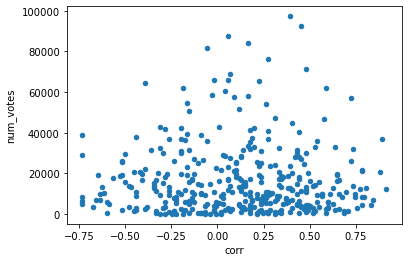

How about the collaborative filtering embedding?


No popularity bias can be observed, indicating that the bias term in factorization algorithm was fitted properly.

### Correlation between Content Based and Collaborative Filtering Embedding

We saw that Cast&Crew brings redundant information to the Content Embedding. How about Collaborative Filtering? Can we expect similar results between Content Based and Collaborative Filtering Embedding?

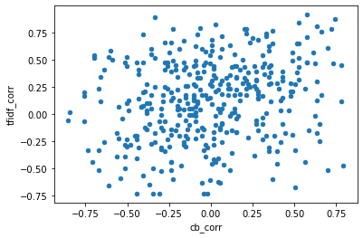

We can observe that there is no strong correlation between text embedding and collaborative filtering embedding. The Pearson's correlation between than is `0.2`. It may be a indicative that both methods are complementary. So, combining than can provide a even better performance. It is the intuition behind the Hybrid Approach.

## Justification

We got very bad results for precision and recall. But it is not a problem, since the user correlation similarity is just a reference for us. In the previous tests we saw interesting recommendations given by embedding similarity. We had to choose a method to compare with and we tried a reference that provides good recommendations, but is sparse (you need users in common to link a pair of movies) and very expensive to compute. Maybe a method based on the most popular movies (always recommend the most popular movies) could provide a better reference.

Anyway, in the recommendation dashboard we can get really interesting recommendations for the embedding methods.

# Conclusion

## Free-Form Visualization

Embedding features can efficiently capture content and user-interaction information and represent than in a low-dimensional and dense space. It allows fast nearest neighbors searching and provides continuous recommendations. We are able to establish a link between any pair of items, where a distance measure provides the evidence of similarity between the pair. In addition, they allow combining information from different sources, like we did in the Hybrid approach.

Moreover, we are able to visualize the embedding features using techniques like PCA, t-SNE or UMAP. It can be very insightful!

Here it follows a screenshot from the Embedding Projector:


We can observe a large number of small groups. They are movie clusters, grouped by content similarity and/or user-interaction similarity.

Let's inspect one of them:


Nice! It's a Comedian cluster.

So, embedding features have a large contribution! They are very powerful for recommendation, but can be effectively applied in many other Machine Learning problems, like movie clustering, movie genre classification, movie success prediction, movie profitability prediction, so on.

## Reflection

The problem solved in this project was very challenging. We choose a large dataset to work with. It came from 2 sources, one that contains movie metadata and other that contains user-interaction data. Firstly, we had to transform data to a tidy format using a quite advanced data cleaning skills. Then, we carefully represent all features as numerical sparse vectors to allow fast and memory efficient embedding extraction. Some data manipulations required more robust tools, like `vaex`. We carried about the nearest neighbor searching performance, so we brought `faiss` to solve the problem.

All steps were new for me! I had to study every technique and every package used here.

To make the results accessible by others, we published the embedding features on the Embedding Projector. In addition, we created a web application that allows experimenting with Content Based, Collaborative Filtering and Hybrid recommendations. The application runs nearest neighbors searching in real time and provide recommendations in milliseconds. It can be deployed easily through the `Dockerfile` we provide. We tried to deploy it on Heroku, but after a entire night trying, we decided to move on. 

In summary, I'm very proud about the results! I know that I'm subjected to personal bias. But I kept a version of the application deployed in my computer and I'm using it to get recommendations based on my favorite movies. I'm enjoying it. I even watched some of the recommendation I received!

## Improvement

I would like to use the `implicit` package to replace the TruncatedSVD algorithm. It provides some modern factorization algorithms that can improve embedding representation. 

The `LightFM` allows to factorize the utility matrix together with item and user metadata. It is an interesting alternative to the Hybrid approach. I would like to experiment with it.

Graph algorithms are becoming so popular nowadays. The utility matrix can be represented as a graph, where nodes are the movies and edges are users that interacted with them. Then, we can apply some Graph Embedding technique like DeepWalk, Node2Vec or VERSE to extract movie embedding features. It's a very promising solution.

# References

[1] [Google's Introduction to Recommendation Systems](https://developers.google.com/machine-learning/recommendation).

[2] [Building a real-time embeddings similarity matching system](https://cloud.google.com/solutions/machine-learning/building-real-time-embeddings-similarity-matching-system).

[3] [The Amazon Recommendations Secret to Selling More Online](http://rejoiner.com/resources/amazon-recommendations-secret-selling-online/).

[4] Anderson, Chris. The long tail: Why the future of business is selling more for less. Hyperion, 2006.

[5] [Overview: Extracting and serving feature embeddings for machine learning](https://cloud.google.com/solutions/machine-learning/overview-extracting-and-serving-feature-embeddings-for-machine-learning).